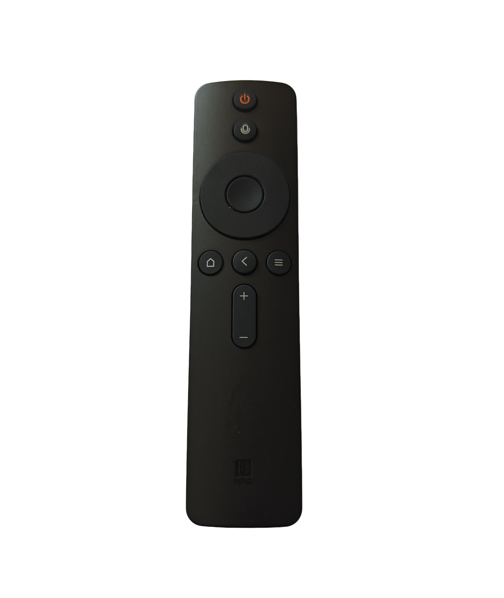

# Clay-Mic

把蓝牙遥控器的语音键接到 Windows PC 上：按下语音键说话 → 本地 Whisper 转写 →（可选）LLM 格式化成 Markdown → 直接上屏到当前输入框。

面向「用遥控器当麦克风」的免手打场景：躺在床上、拿着遥控器、对着任意程序口述，文字自动出现在光标处。

> **MIT** ｜ Windows 10/11 ｜ Tauri 2 · React 19 · Rust ｜ 识别完全本地，可离线

---

## 功能特性

- **遥控器语音输入**：通过 BLE（ATVV 协议）连接支持 ATVV 的 BLE 遥控器，语音键按下即录音。
- **设备识别**：连接列表只列支持 ATVV 的设备，连接后显示遥控器型号。
- **本地离线转写**：whisper.cpp，支持 CPU 与 NVIDIA CUDA，模型完全本地，不联网。
- **边说边转（可选）**：录音时实时显示部分转写预览（滑动窗口局部转写）。
- **模型与后端自由选**：tiny ~ large-v3-turbo（含量化版）；CPU / CUDA 12.4 / CUDA 11.8 各自独立安装，可共存、随时切换。
- **引擎预热**：状态栏显示 STT 引擎是否已加载，可手动预热，避免首次识别冷启动。
- **LLM 格式化（可关）**：接入任意 OpenAI 兼容 API 整理成 Markdown；关闭则直接用原始转写。
- **初始 Prompt**：注入专业词/人名，提升同音字与术语识别率。
- **一键上屏**：自动注入当前前台窗口，不切换焦点、不抢前台。
- **悬浮窗**：全局热键唤出结果列表，键盘选择后注入，四种主题。
- **按键映射**：遥控器按键可配置为语音 / 忽略 / 直通 / 发送组合键 / 程序自定义（如清空输入框），支持原生按键屏蔽。
- **驱动补丁**：把 Windows 不断增长的键鼠设备编号折回 `0`~`9`，从根上避免 Interception 的上游缺陷导致键鼠失灵。
- **托盘常驻 + 单实例**：关闭窗口驻留托盘，重复启动只唤回已有窗口。
- **历史与统计**：SQLite 持久化历史与统计；统计含语音次数、时长与 LLM token 用量。

---

## 工作原理

```
遥控器语音键
   │  BLE (ATVV 协议)
   ▼
MIC_OPEN → 音频流 (ADPCM) ──► IMA/DVI ADPCM 解码 → 16kHz WAV
                                        │
                                        ▼
                              whisper.cpp 转写 (常驻 whisper-server)
                                        │
                                        ▼
                          （可选）LLM 格式化 → Markdown
                                        │
                                        ▼
                          注入到当前前台输入框（剪贴板 / 逐字）
```

- 转写走常驻 `whisper-server`（模型常驻内存/显存），拿不到时才回退到一次性 `whisper-cli`。
- 上屏不调用 `SetForegroundWindow`：直接往当前前台窗口粘贴，避免抢焦点失败。
- 录音与处理期间，程序自身窗口均为非聚焦窗口，目标窗口始终保持焦点。

---

## 环境要求

- **仅支持 Windows 10/11**——核心功能依赖 WinRT BLE、Interception 驱动与 Win32 输入注入，**macOS / Linux 无法构建与运行**
- **Node.js** ≥ 18、**Rust** stable、Tauri 的[系统依赖](https://tauri.app/start/prerequisites/)

前端依赖由 `npm install` 安装，Rust 依赖由 `cargo` 构建时自动拉取，都无需手动处理（清单见 `package.json` / `src-tauri/Cargo.toml`）。以下是**不随包分发、需单独获取**的部分：

| 依赖 | 用途 | 获取方式 |
|---|---|---|
| whisper.cpp 运行时 | 语音识别引擎（`whisper-cli` / `whisper-server`） | 设置内「下载运行时」：CPU / CUDA 12.4 / 11.8 |
| Whisper 模型 | `ggml-*.bin` | 设置内「下载模型」（HuggingFace `ggerganov/whisper.cpp`） |
| [Interception](https://github.com/oblitum/Interception) 驱动 | 键盘拦截/屏蔽 | 需自行安装（管理员）；**仅「按键屏蔽」需要**，可选 |
| NVIDIA 驱动 | GPU 加速 | CUDA 版运行时已内置所需库 |

> **关于 Interception**：程序通过 `libloading` 在**运行时动态加载 `interception.dll`**，只调用其公开 API（不链接、不分发）。未安装时其余功能不受影响，仅无法屏蔽原生按键；授权说明见 [`THIRD-PARTY-NOTICES.md`](THIRD-PARTY-NOTICES.md)。
>
> **关于驱动补丁**：Interception 有一个上游缺陷——Windows 每次重新枚举键鼠设备（休眠唤醒、插拔）都会递增设备编号，而驱动只认个位数编号，用尽后**键鼠会完全失灵且只能重启**。程序自带 `clay-mic-keyslots.exe`，点「安装驱动和补丁」时会与驱动一并注册为开机服务（一次 UAC，无需分步），把编号折回 `0`~`9`，从根上避免该问题（已在本机实测：安装后插拔键盘，编号不再超过 9）。

---

## 快速开始

从 [Releases](../../releases) 下载 `Clay-Mic-<版本>-portable.zip`，解压后双击 `Clay-Mic.exe` 即用。

从源码构建（开发/构建才需要）：

```bash
npm install          # 安装前端依赖
npm run tauri:dev    # 开发模式（保留控制台日志）
npm run package      # 打包绿色版：三件套 + portable.zip → packages/Clay-Mic-<版本>/
```

首次运行后，在「设置 → 语音识别」中：

1. 选**运行后端**（CPU 或 GPU · CUDA），点「下载运行时」；
2. 选**模型**（推荐 `large-v3-turbo`），点「下载模型」；
3. 语言建议显式选「中文」而非自动检测；
4. 到「连接」页选已配对的遥控器并连接；
5. 若要用「按键屏蔽」，到「设置 → 按键拦截」：**先「下载驱动」，再点「安装驱动和补丁」，最后重启**。一次 UAC 同时装好驱动与补丁；重启后驱动生效，补丁每次开机自动生效。

---

## 配置

配置文件 `%LOCALAPPDATA%/clay-mic/config.json`：

| 分组 | 说明 |
|---|---|
| `device` | 已连接的遥控器：设备 id、型号、PnP VID/PID（连接时自动推导） |
| `stt` | 模型、语言、初始 Prompt、运行后端、边说边转开关、可执行文件/模型路径（高级） |
| `llm` | 是否启用、provider、模型、API Key、Base URL、格式化 Prompt、超时与 token 上限 |
| `overlay` | 全局热键、主题、尺寸、位置 |
| `inject` | 注入方式：`clipboard`（粘贴）或 `keyboard`（逐字） |
| `indicator` | 语音指示器样式 |
| `window` | 主窗口尺寸 |

全部数据都在 `%LOCALAPPDATA%/clay-mic/` 下：`config.json`、`clay-mic.db`（历史与统计）、`whisper/`（运行时与模型，按后端分目录）、`clay-mic.log`（日志）。整目录可整体拷贝或删除。

驱动补丁的运行记录在 `%ProgramData%/clay-mic/`：`keyslots.json`（上次执行状态）、`keyslots.log`（日志）。放在这里是因为服务以 SYSTEM 身份运行，用不了按用户的 `%LOCALAPPDATA%`。

中文场景推荐 `large-v3-turbo`（质量接近 large-v3、速度明显更快）；显存紧张用 `large-v3-turbo-q5_0`。

---

## 设备兼容性

面向 **BLE + ATVV**（Android TV Voice over BLE）设备。连接列表只显示**暴露 ATVV 服务**的已配对设备。

| 要求 | 说明 |
|---|---|
| BLE 且已在 Windows 配对 | 使用前请先在 Windows 蓝牙设置中配对 |
| 暴露 ATVV 服务 | `AB5E0001-5A21-4F05-BC7D-AF01F617B664` |
| 特征遵守标准布局 | TX `…0002` / 音频 `…0003` / 控制 `…0004` |
| 能力报文可解析 | ATVV v0.4 或 v1.0 |
| 音频编码 | IMA/DVI ADPCM（8 kHz / 16 kHz） |
| 「按键屏蔽」额外要求 | 设备暴露 PnP ID（DIS 特征 `0x2A50`），且 Windows 枚举出 HID 键盘子节点 |

已实测设备：

- **小米盒子 5 出厂遥控器**（型号 `ARN9`）

  

其他型号未经实测。若你实测通过，欢迎到 [Issues](../../issues) 反馈型号（附设备名 / VID:PID 更好）。

---

## 与同类项目的区别

同类项目多把语音识别交给**输入法**（微信、豆包等）或**云 API**，由输入法负责上屏。本项目走另一条路：**本机 whisper.cpp + 自行注入**。

| | 输入法方案（多数同类） | Clay-Mic |
|---|---|---|
| 识别 / 语言 | 输入法（多限中文） | 本机 whisper，多语言，可离线 |
| 上屏 | 由输入法完成 | 注入任意输入框 |
| 后处理 | 不可定制 | 任意 OpenAI 兼容 LLM |
| 隐私 | 音频/文本经厂商 | 音频不出本机 |

取舍：前者轻、上屏省事；本项目重，但自包含、可离线、可定制。

---

## 常见问题

**双击没反应 / 白屏打不开？** 绿色版依赖系统 WebView2 Runtime（Win10/11 随 Edge 预装，通常已有）。若缺失，安装 [WebView2 Runtime](https://developer.microsoft.com/microsoft-edge/webview2/download/) 后重试。

**识别质量不理想？** 语言从「自动检测」改「中文」，换更大模型；在「初始 Prompt」填专业词/人名。

**首次识别慢？** 需要冷启动加载模型。点右上角 STT 徽标手动预热即可。

**切换后端后显示「待机」？** 换后端会换掉常驻 server，点一下徽标重新预热。

**上屏上不去？** 目标窗口若以管理员运行而本程序不是，会被 UIPI 拦截；文本仍保留在列表中，可手动复制。

**关掉窗口程序还在？** 托盘应用的预期行为；退出请用托盘菜单的「退出」。

**键盘鼠标突然失灵了？** 这是 Interception 驱动的上游缺陷：它只认个位数的键鼠设备编号，而休眠唤醒会让 Windows 重新枚举设备并递增编号，用尽后键鼠会完全失灵，且**无法在本机重置**（只能重启）。**安装驱动时一并装上的驱动补丁可以从根上避免它**——补丁每次开机把编号约束在 0~9，设备拿不到会溢出的编号。若仍出现失灵：重启即可恢复输入；随后点「安装驱动和补丁」并重启，恢复屏蔽与补丁。

---

## 贡献

开发环境、提交规范与发布流程见 [`CONTRIBUTING.md`](CONTRIBUTING.md)。

---

## 更新日志

版本变更见 [`CHANGELOG.md`](CHANGELOG.md)。

---

## 许可

以 **MIT** 发布，见 [`LICENSE`](LICENSE)。第三方组件的许可见 [`THIRD-PARTY-NOTICES.md`](THIRD-PARTY-NOTICES.md)。
